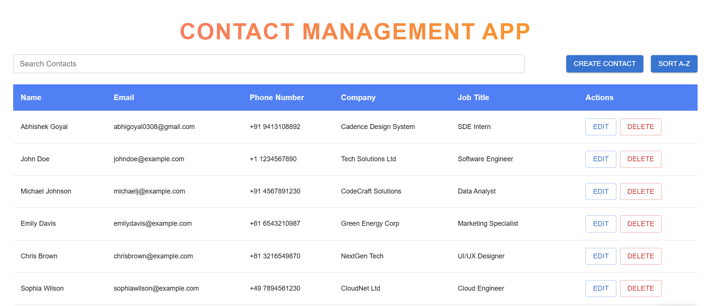
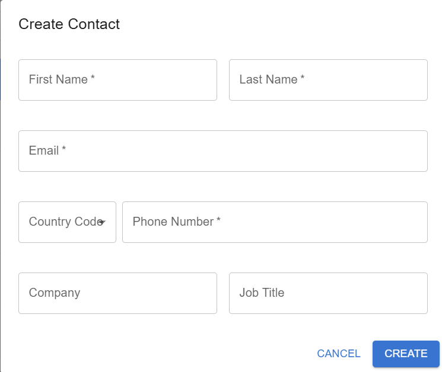
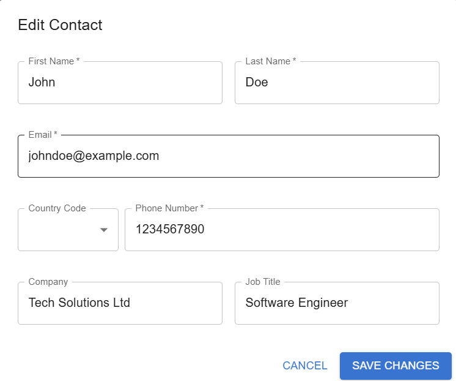
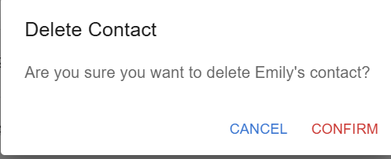

# Contact Management - Mini Feature of a CRM

## 📝 Project Overview
This project implements a **Contact Management System**, a mini feature of a CRM application. It enables users to efficiently **Add**, **View**, **Edit**, and **Delete** contact details, all in one place, using a clean interface built with **ReactJS** and **Material-UI** components. The backend API is built with **NodeJS** and handles the database interactions seamlessly.

---

## ✨ Features

- **Add Contacts:** Create new contacts with fields for First Name, Last Name, Email, Phone Number, Company, and Job Title.
- **View Contacts:** Display all contacts in a paginated and sortable table.
- **Edit Contacts:** Update contact details directly from the table.
- **Delete Contacts:** Remove outdated or irrelevant contact entries.
- **Search Functionality:** Search for contacts by name, email, or company to quickly find specific entries.
- **Pagination & Sorting:** Add pagination and sorting to the table for better usability, allowing users to easily navigate through large contact lists.
- **Validation & Error Handling:** Ensures that required fields are filled, and duplicates or invalid data are handled gracefully.
---

## 📂 Directory Structure
📦project-root ┣ 📂backend ┃ ┣ 📜server.js ┃ ┣ 📂routes ┃ ┃ ┗ 📜Contact.routes.js ┃ ┣ 📂models ┃ ┃ ┗ 📜Contact.model.js ┃ ┗ 📜package.json ┣ 📂frontend ┃ ┣ 📜src ┃ ┃ ┣ 📂components ┃ ┃ ┃ ┣ 📜ContactForm.js ┃ ┃ ┃ ┗ 📜ContactsTable.js ┃ ┃ ┣ 📜App.js ┃ ┃ ┗ 📜index.js ┃ ┗ 📜package.json ┗ 📜README.md

## 🖼️ Images

Here are some screenshots of the application:



<div style="display: flex; justify-content: space-between;">



</div>
---

## 🛠️ Tech Stack

- **Frontend:** ReactJS with Material-UI (MUI)
- **Backend:** Node.js with Express.js
- **Database:** MongoDB
- **API Testing:** Postman
- **Deployment:** Vercel (frontend), Vercel (backend)

---

## 🚀 How to Set Up the Project

### Prerequisites

- Node.js installed
- MongoDB set up locally or using a cloud provider (e.g., MongoDB Atlas)

### Backend Setup

1. Navigate to the `backend` directory:
   ```bash
   cd backend
2. Install dependencies:
   ```bash
   npm install
3. Create a `.env` file in the `backend` directory with the following content:
   ```bash
   MONGO_URL=your_mongo_connection_string
   PORT=5000
4. Start the backend server
   ```bash
   npm start
### Frontend Setup
1. Navigate to the `frontend` directory:
   ```bash
   cd frontend
2. Install dependencies:
    ```bash
    npm install
3. Start the React application:
   ```bash
   npm run dev
## 📋 Database Schema

### MongoDB Collection: `contacts`

| **Field**    | **Type**   | **Description**              |
|--------------|------------|------------------------------|
| `_id`        | ObjectId   | Unique ID for each entry     |
| `firstName`  | String     | Contact's first name         |
| `lastName`   | String     | Contact's last name          |
| `email`      | String     | Contact's email              |
| `phone`      | String     | Contact's phone number       |
| `company`    | String     | Company name                 |
| `jobTitle`   | String     | Job title                    |

## 📚 API Endpoints

| **Method** | **Endpoint**       | **Description**                |
|------------|--------------------|--------------------------------|
| `POST`     | `/contacts`        | Add a new contact              |
| `GET`      | `/contacts`        | Retrieve all contacts          |
| `PUT`      | `/contacts/:id`    | Update a contact's details     |
| `DELETE`   | `/contacts/:id`    | Delete a specific contact       |


## 🏆 Challenges & Solutions

1. **Pagination and Sorting**  
   - **Challenge:** Implementing efficient pagination and sorting in the contacts table.  
   - **Solution:** Used Material-UI’s table pagination and sorting utilities.

2. **Database Connection**  
   - **Challenge:** Handling connection errors for MongoDB.  
   - **Solution:** Added error handling with fallback options and environment variables.

3. **Deployment Issues**  
   - **Challenge:** Coordinating deployment of separate frontend and backend services.  
   - **Solution:** Deployed frontend on Vercel and backend on Vercel with appropriate environment configurations.

---

## 🌟 Key Learnings

- Practical experience with ReactJS and Material-UI for clean and consistent UI.
- Learned about API integration and efficient state management in React.
- Gained insights into backend error handling and database CRUD operations.

---

## 📦 Deployment Links

- **Frontend:** [Frontend Deployed Link](https://erinophonecontact.vercel.app/)  
- **Backend:** [Backend Deployed Link](https://erino-drab.vercel.app/)


### Notes:
1. Replace `your_mongo_connection_string` in the backend `.env` example with your actual MongoDB URI.
2. Update the **Frontend** and **Backend Deployed Links** with the real URLs after deployment.

This README includes everything you need: setup instructions, sample API calls, challenges, and deployment information.

## 📄 Author
- **Name:** Abhishek Goyal  
- **Portfolio:** [Abhishek's Portfolio](https://abhishekgoyal.vercel.app/)  
- **Email:** [agoyal0308@gmail.com](mailto:agoyal0308@gmail.com)
